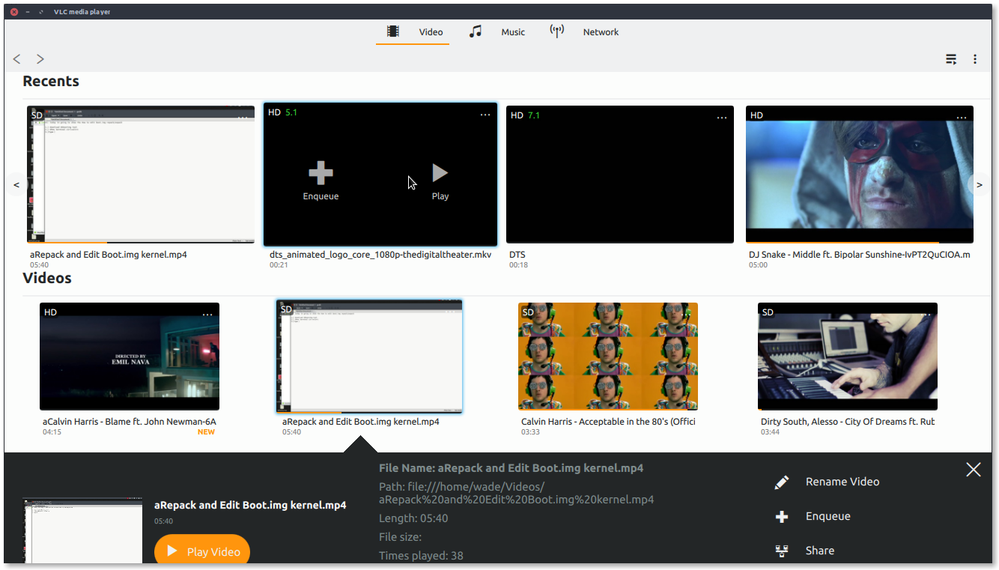
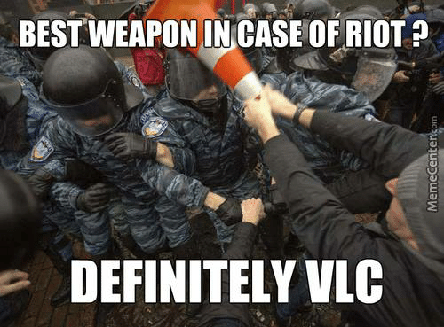

# My GSoC Journey - A peek into my cone story

## Introduction

My task was to work on the UI for VLC 4.0 for linux. This document summarizes what I did for GSoC.

    
     
    <i> VLC 4.0 preview  </i>
     

## Initial stage

VideoLan requires that potential GSoC students submit a patch. This was my first patch:

#### Merged
[qt: implement recent medias menu](https://github.com/videolan/vlc/commit/28916d77a817293e3b7d1e5feae20954760f2d13)

#### Not merged
>*- none -*

## Community bonding period

Before the coding period officially began, I started by working on some issues from the [bug tracker](https://trac.videolan.org/vlc/). This helped me understand the codebase better.

Here are the commits of that period:

#### Merged

[qt: enable loading/saving settings using qml](https://github.com/videolan/vlc/commit/52eb01269e9e91db845be1e979afa06220653ff6)

[qt: enable windowed playlist](https://github.com/videolan/vlc/commit/3d7215299e9d34e073977a64ed7644441b5e61f6)

[re-indent after last change](https://github.com/videolan/vlc/commit/f2fd2df5d09df9402e4a7c04ff41eb1622a3d1da)

[qt: fix missing return value in ChapterModel](https://github.com/videolan/vlc/commit/a8c927f7c792f5b03e8ea151440bc559fa2ca999)

[qml: add seekpoints to sliderBar](https://github.com/videolan/vlc/commit/ac89539e3d35d5c79b39e03ea0a0bef49a4cd58f)

[qml: add timeIndicator on top of sliderBar](https://github.com/videolan/vlc/commit/f9243e9a2be0c6a91acd48b2b05bca637e78f8e4)

[qml: fix slider onHold issue](https://github.com/videolan/vlc/commit/5ebc2ca574540f31580f01105efd3da6927c267e)

[qml: add buffer indicator](https://github.com/videolan/vlc/commit/e332a704a2a89346432dcd080dd92b4548f55b00)

[qt: add positionRole on ChapterListModel](https://github.com/videolan/vlc/commit/21010e6a8675ddb602c50f06d34c3dd43a7b1780)

[qt: add scale method on VLCTick](https://github.com/videolan/vlc/commit/2d1a1e3085e971cf4298a3995c801fc8f188323a)

#### Not merged
>[qml: add change rate menu](https://github.com/AbelTesfaye/vlc/commit/84ee5da19b1416718961363597b3d4481c0fd596)

## First Phase - Videos grid section 
Here I worked on the gridView for videos, and a couple of other stuff.

#### Merged

[indent gridItems.qml](https://github.com/videolan/vlc/commit/552869f57b684378268aed8153d41f79d534e1c0)

[qml: add top left labels](https://github.com/videolan/vlc/commit/8ffe4fc2517dfa7cbb4fca165af3b649a473e68a)

[qml: cover rounded border, animation and glow](https://github.com/videolan/vlc/commit/95c66a065bbeaaa25a962082b7b25cd39c18e2b8)

[qml: add textHolderRect](https://github.com/videolan/vlc/commit/4720a2b3dd94fae21f5301e80ca24e06a0621638)

[qml: add enqueue and play text](https://github.com/videolan/vlc/commit/4103d57b3c71b2a746046665f9aec14cdea3a650)

[qml: add contextMenu](https://github.com/videolan/vlc/commit/abe3929e5e0213060593ec098543a70bc2bc33d4)

[qml: add progressBar](https://github.com/videolan/vlc/commit/b09fba7b15c796e655735369dc33686106c1634d)

[qml: change width if video](https://github.com/videolan/vlc/commit/f4680b5f0d69905e71f23c8ed085d691bd24a5eb)

[qml: add infoLeft and infoRight](https://github.com/videolan/vlc/commit/29f46a3ffd1d507a07e9b8475e33ee7cc73c3de9)

[qml: add gridView header](https://github.com/videolan/vlc/commit/4c9b69f874022441d35736c3b3c1ed64cb19ff01)

[qml: use Rectangle instead of Item](https://github.com/videolan/vlc/commit/60b0f06697df4e798f6f702717fb57321a0894ae)

[qt: create MLRecentsVideoModel](https://github.com/videolan/vlc/commit/1f31213fe343e66eb6035c7211eabfb790676918)

[qt: add channel, position, audioDesc, videoDesc and resolution roles & properties](https://github.com/videolan/vlc/commit/c5264d1aa92530dc28bd60f6a9340fb69de56506)

[qt: make ml entry point manager ui](https://github.com/videolan/vlc/commit/68d9852c7b261c0c959e502e793947dd8cb2479c)

[qt: make ml_folders_model](https://github.com/videolan/vlc/commit/c0891a6f1ce5cc1e3f1bdec6b28038e9063863b8)

#### Not merged
>*- none -*

## Second Phase: Videos list, recents and expandable grid for videos

#### Merged

[qml: remove conflicting anchor warning for gridView ](https://github.com/videolan/vlc/commit/476aad59b9204dea9a208dea191b2e1f973afde9)

[qml: add list/grid button on topbar](https://github.com/videolan/vlc/commit/3acdd098762218149cad4e90de78ab73b39904b3)

[qml: add borderRadius to KeyNavigableTableView rows](https://github.com/videolan/vlc/commit/116bb44d691cc8c6579bd43e89d785863b7354d0)

[qml: emphasize MusicAlbumsGridExpandDelegate title](https://github.com/videolan/vlc/commit/793a9986bf55865796eed2c5f0de4fa1e72aabae)

[qml: emphasize MusicTrackListDisplay title](https://github.com/videolan/vlc/commit/193f8eaa0b75754460916e94e7e56b2da3f92794)

[qml: use colDelegate on MusicTrackListDisplay](https://github.com/videolan/vlc/commit/42b02221f68b44ebfe24b81a92d23ed436528230)

[qml: use colDelegate for MCVideoListDisplay](https://github.com/videolan/vlc/commit/326cbb5a78cced07ada8045b3be8ef8eac283c90)

[qml: use MCVideoListDisplay](https://github.com/videolan/vlc/commit/ab338159abdd6e399d8c00881cc865849737a491)

[qml: add MCvideoListDisplay](https://github.com/videolan/vlc/commit/8f0d254a1d23131f0564e02f968d876f0a659282)

[qml: use dynamic Columns on KeyNavigableTableView](https://github.com/videolan/vlc/commit/8d0aba3063b0d5fd75ec467bf9e71d45b86362a7)

[qml: use previously refactored components on gridItem.qml](https://github.com/videolan/vlc/commit/29571b56095aa081e329257cf00f9625b1fa3e8c)

[qml: add ContextButton, VideoQualityLabel, VideoProgress and RoundImage](https://github.com/videolan/vlc/commit/a47ddaa7358c51ceb56bd079179f51d85242e2cb)

[qml: add ellipsis, grid and list icons](https://github.com/videolan/vlc/commit/6e01c8c56b415586e7f9edcad0327797e4de3f52)

[qml: remove row margins from KeyNavigableTableView](https://github.com/videolan/vlc/commit/c241ead2326c6590665d4af87a2cf8d6b380be0d)

[qt: add criteriaToName to mlvideomodel ](https://github.com/videolan/vlc/commit/daf58b6c07aa74cd97e0792e44466ab8a0909a64)

[qt: add title_first_symbol property to mlvideomodel](https://github.com/videolan/vlc/commit/4d856f3e20c571fe18f70007492a031d148829a7)

[qml: set proper width for tableView Delegate](https://github.com/videolan/vlc/commit/cb77d2fdd842607f23a936d0edfeb050eb4f3abf)

[qml: restore artist text ](https://github.com/videolan/vlc/commit/a458904e0e364cf0355986dfecbc107ab30dc7da)

[qml: flick Album to Vertical only](https://github.com/videolan/vlc/commit/134660f5dfd2535a5a025b51c818f049272eff3e)

[qml: fix contextMenu to item](https://github.com/videolan/vlc/commit/1c93dbb29583d34280b7915fc08d3320fb5e6b73)

[qml: add recents section](https://github.com/videolan/vlc/commit/7bd13a56dee55358faf24781cf4d1c895344d014)

[qml: infoWin using expandableGridView](https://github.com/videolan/vlc/commit/8b2f4237cce3cf04fd25872adff1667a823b012d)

[qml: add close, del, rename icons](https://github.com/videolan/vlc/commit/6981611daa536f25ec98a52a1864dd55ead25138)

[qml: add LabelSeparator and RoundButton](https://github.com/videolan/vlc/commit/0499cb1a17ec1d31239e3ee6635ded6c2d4c1647)

#### Not merged
>*- none -*

## Final Phase: Networks main page, list and grid view for networks

#### Merged

[qml: make main network sections](https://github.com/videolan/vlc/commit/e8abd40800f7cde201ca47c943131e978595cce8)

[qml: make multiple models to support main networks](https://github.com/videolan/vlc/commit/3429dd78fee916e6da7fb4574e69063d3896603e)

[qml: access grid/list index using viewIndexPropertyName](https://github.com/videolan/vlc/commit/b29646e6166e1603ecd6e3998ac502878de51f38)

[qml: assign drive image using new types](https://github.com/videolan/vlc/commit/d79f286675ea19ee92afbaa14e0b6894cae862c6)

[qml: add MCNetworksSection and MCNetworksSectionSelectableDM](https://github.com/videolan/vlc/commit/5ab69010bb351f4b84a6dfa584070533e43ca651)

[qt: add sd_source property to networkModel](https://github.com/videolan/vlc/commit/eedb771cee1feb32de5a1313b037165f5ddc1c8f)

[qml: expose contentWidth of listView](https://github.com/videolan/vlc/commit/5965165aa04987eb33419ef8a7f6b5c513ef25f1)

[qml: highlight roundButton when on activeFocus](https://github.com/videolan/vlc/commit/feba5fc418fcf921371466853f5e669ceecdad29)

[qt: add is_on_provider_list qproperty](https://github.com/videolan/vlc/commit/ad822d125b519966080ef396be46a06bbf58ef15)

[qml: padding for contextButton](https://github.com/videolan/vlc/commit/cf548a85d6e91f9ed9bd63e298c8608de87cfe48)

[qml: set the backgroundColor of actions buttons in ListItem](https://github.com/videolan/vlc/commit/ff895a95b0d26ccdba2e22e6448989249e2e6e05)

[qml: set the highlightColor of actions buttons in ListItem](https://github.com/videolan/vlc/commit/3145b995971e05f3bdcd6506b1c95a74c33d8eaf)

[qml: stop flicker on toolButton hover](https://github.com/videolan/vlc/commit/bcb6be7d79d2752b1a1a17c475f7f85da9ec0101)

[qml: show contextMenu on rightClick](https://github.com/videolan/vlc/commit/2f6bdd34b21eaa5f0ada2f51fb3cbe253b702523)

[qml: fix itemClicked Signal](https://github.com/videolan/vlc/commit/492dad8be02f6076080bc1e97bb8884d8e9b1134)

[qml: use contextButton](https://github.com/videolan/vlc/commit/6408ea40845b16d12120c667c2dd0979d1c1f938)

[qml: remove actionButtons for drive](https://github.com/videolan/vlc/commit/7e725647c6a106a0a55335975fddcdf5fe9e31b6)

[qml: fix focusIndex not found when closing contextMenu](https://github.com/videolan/vlc/commit/65bdf716fb7ebf739c6142170ed01e5087d450ce)

[qml: add contextMenuButton to listitem](https://github.com/videolan/vlc/commit/baa3943e45b47a0c60e54a278155241d8e768571)

[qml: increase height for glow on all ListItems](https://github.com/videolan/vlc/commit/77b5255cc52bd33fa681d7ebe5d40b27095f3e8c)

[qml: add glow and rounded border on ListItem](https://github.com/videolan/vlc/commit/78817017db7c27385108d64a214da199ee2688fe)

[qml: expose contextButton visibility](https://github.com/videolan/vlc/commit/b5a26ae65d8779b468aae1d7eb58538e69968417)

[qml: add grid component for networks](https://github.com/videolan/vlc/commit/90acbbd71226def365ae13f7510395c87e914628)

[qml: use stackViewExt for networkDisplay](https://github.com/videolan/vlc/commit/d45733ea83edf85455877a1ad0520044fbf2035e)

[qml: add Network Drive and File Grid Items](https://github.com/videolan/vlc/commit/d62454278637067a2f02f416f096b2705efe5504)

[qml: add network contextMenu](https://github.com/videolan/vlc/commit/d9821a3dbee2c7f36d626b2603f24bd1a4258e22)

[qml: reduce default menu size](https://github.com/videolan/vlc/commit/4c9cd3cd01c801f557535664671d66a46cc7b6f0)

[qt: make "FILE_TYPES" un-indexible](https://github.com/videolan/vlc/commit/86acf758b5a847f8bce709f222c28b84d7d57e65)

[qt: remove 'go to parent' item from networkmodel](https://github.com/videolan/vlc/commit/eabf5cdd52c96d6a7a69a33095cc16862df08ced)

#### Not merged
>*- none -*

### Challenges during development:
Well, the past few months were certainly eventful:

1. I started GSoC before I finished class, I did both coursework and VLC tasks in parallel. That was definitely challenging :)
2. I fried my main laptop's motherboard just before starting GSoC. Good bye portability and fast compilation cycles.
3. A major political unrest occured in my country, then Internet in the whole country was shut down. This lasted for ~4 work days, fortunately the folks at videoLan were considerate about this.
4. I had surgery to remove my appendix, another 5 work days gone here.

    
     
    <i> GSoC was awesome! </i>

